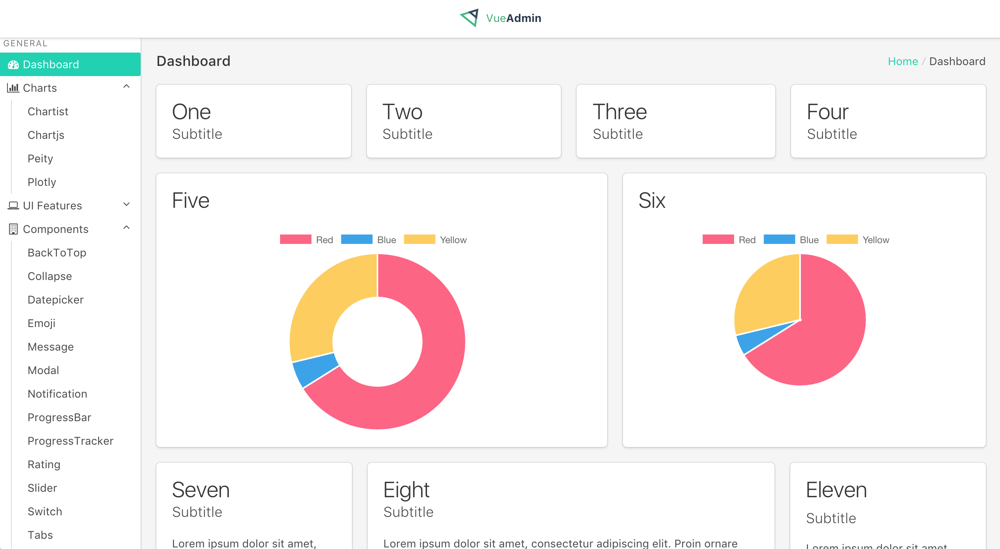

<h1 align="center">Vue Admin</h1>

  <strong>Vue Admin Panel Framework</strong>,
  <a href="https://vue-admin.fundon.me">Live Demo</a>

  Made with ❤︎ by
    <a href="https://twitter.com/_fundon">Fangdun Cai</a> and
    <a href="https://github.com/fundon/vue-admin/graphs/contributors">contributors</a>
  

## Features

* Powered by [Vue][] **2.0** & [Bulma][]
* Responsive and Flexible Box Layout
* [Variety of Charts](doc/charts.md)
* [Rich Components](doc/components.md) or See [vue-bulma][]
* Based on the awesome third-party [libraries](doc/dependencies.md)

## [Backers](backers.md)

Its ongoing development is made possible thanks to the support by these awesome backers. If you'd like to join them, check out [Vue Admin & Vue Bulma](https://www.patreon.com/_fundon)'s Patreon campaign.

## [Development](doc/development.md)

### Requirements

  * NPM v3

## Notes

  If you want to use Vue Admin with Vue 1.0 version, please checkout the [master](https://github.com/fundon/vue-admin/tree/master) branch.

## Badges

---

> [fundon.me](https://fundon.me) &nbsp;&middot;&nbsp;
> GitHub [@fundon](https://github.com/fundon) &nbsp;&middot;&nbsp;
> Twitter [@_fundon](https://twitter.com/_fundon)

[Live Demo]: https://vue-admin.fundon.me/
[Fangdun Cai]: https://twitter.com/_fundon
[Vue]: http://vuejs.org
[Bulma]: http://bulma.io
[Vue-bulma]: https://github.com/vue-bulm://github.com/vue-bulma
