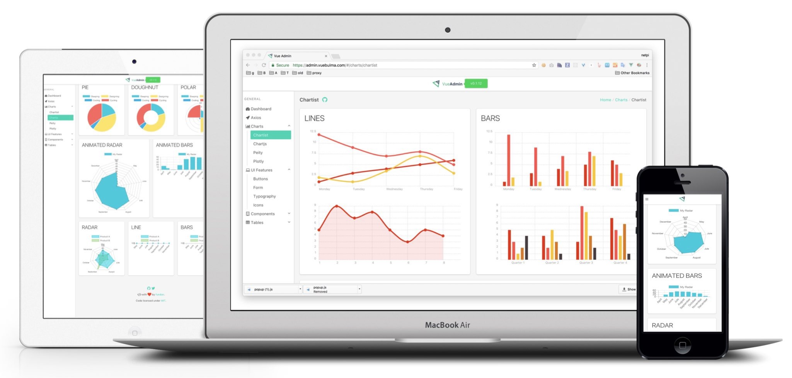

<h1>Vue Admin</h1>

  <strong>Vue Admin Panel Framework</strong>,
  <a href="https://admin.vuebulma.com">Live Demo</a>

  Made with ❤︎ by
    <a href="https://twitter.com/_fundon">Fangdun Cai</a> and
    <a href="https://github.com/vue-bulma/vue-admin/graphs/contributors">contributors</a>
  

## Features

* Powered by [Vue][] **2.0** & [Bulma][] **0.3**
* Responsive and Flexible Box Layout
* [Variety of Charts](doc/charts.md)
* [Rich Components](doc/components.md) or See [vue-bulma][]
* Based on the awesome third-party [libraries](doc/dependencies.md)

## [Backers](backers.md)

Its ongoing development is made possible thanks to the support by these awesome backers. If you'd like to join them, check out:

* [Patreon campaign](https://www.patreon.com/_fundon)

* [OpenCollective](https://opencollective.com/vue-admin#backer): Support us with a monthly donation and help us continue our activities

## Sponsors

Become a sponsor and get your logo on our README on Github with a link to your site. [[Become a sponsor](https://opencollective.com/vue-admin#sponsor)]

## [Development](doc/development.md)

### Requirements

  * Node >= v5

  * NPM >= v3

  * Webpack v2

## Notes

  If you want to use Vue Admin with Vue 1.0 version, please checkout the [vue-v1](https://github.com/vue-bulma/vue-admin/tree/vue-v1) branch.

  Launch Vue Admin as a desktop application! Please check [Run Project with Electron](https://github.com/vue-bulma/vue-admin/wiki/Guide#run-project-with-electron)

## Maintainers
+ [fundon](https://github.com/fundon) &nbsp;&middot;&nbsp; [fundon.me](https://fundon.me) &nbsp;&middot;&nbsp; [Twitter@fundon](https://twitter.com/_fundon)
+ [luventa](https://github.com/luventa)

[Live Demo]: https://admin.vuebulma.com/
[Fangdun Cai]: https://twitter.com/_fundon
[Vue]: http://vuejs.org
[Bulma]: http://bulma.io
[Vue-bulma]: https://github.com/vue-bulma

